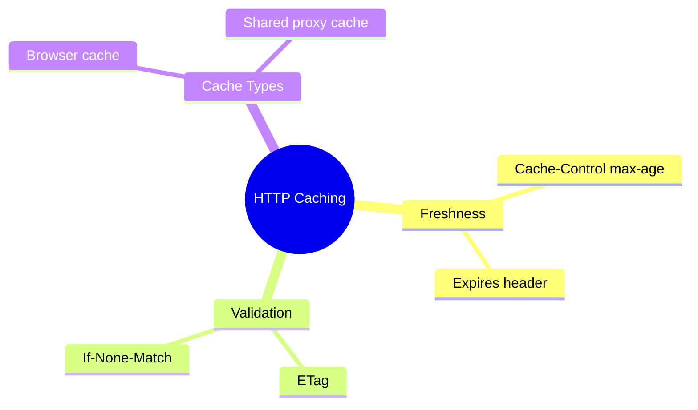
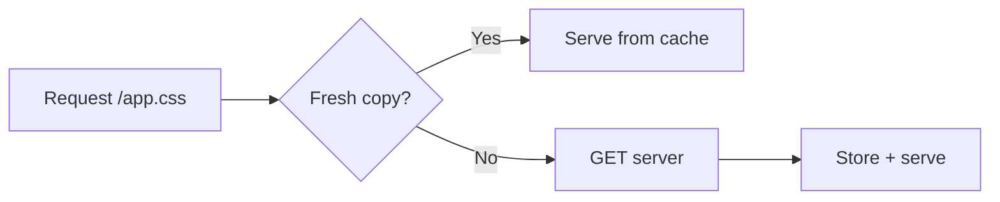

# Module N: [Title]   <!-- Human-readable only. N = plain number, no directory slug (rule 17). Title = syllabus module name, e.g. `# Module 09: Layout & Container Composition`. -->

Est. study time: 1h
Language: en
Description: Sample module on HTTP caching — shows the expected voice, structure, and exercise density. Replace every section with your own content; keep the section skeleton and blockquote forms.

## Knowledge Map



---

## Learning Objectives (maps to course CILOs)
- Explain how a cached response stays "fresh" and what forces revalidation
- Choose between freshness and validation strategies for a given resource

---

## Real-World Example

Your team ships a CSS bundle. An hour later users complain the site still shows yesterday's styles. You did deploy — but their browser never asked the server. The response was still fresh per its `Cache-Control: max-age=86400`, so the browser skipped the network entirely.

> **Think**: Why did the browser not pick up the new file? What would you have done differently?
>
> *Answer: The response was fresh for 24 hours, so no request was made. Either shorten max-age for hashed assets or use fingerprinted filenames with far-future expiry.*

---

## Core Content

### Freshness: telling caches how long to trust a response

Freshness is a contract set by the server. `Cache-Control: max-age=60` says: reuse this response without contacting the server for 60 seconds. During that window the browser renders from disk.



> **Think**: Why does a longer max-age risk showing stale UI after a deploy?
>
> *Answer: Freshness means zero server contact — the cache cannot know the origin changed until the window expires.*

> **Cloze**: "The directive that tells a browser to reuse a response without contacting the server is {max-age}."
>
> *Answer: max-age*

**Example:**
```
Cache-Control: public, max-age=31536000, immutable
# Fingerprinted asset: app.a8f3c2.css — safe to cache for a year
```

> **Predict**: What happens when max-age expires but the file did not change?
>
> *Answer: The browser revalidates; with an unchanged ETag the server returns 304 Not Modified — cheap round trip, no body.*

### Validation: cheap checks instead of full downloads

Validation swaps payload size for a request round trip. The server stamps responses with an `ETag` (a content fingerprint). A stale cache sends `If-None-Match` and gets a 304 unless content changed.

> **Think**: Why is 304 cheaper than 200 even though both hit the network?
>
> *Answer: 304 carries headers only — kilobytes of body are skipped, and downstream caches can keep serving their stored copy.*

> **Cloze**: "A stale cache asks the server whether its copy is current by sending {If-None-Match} with the stored ETag."
>
> *Answer: If-None-Match*

> **Spot the Mistake**: A developer sets `Cache-Control: no-store` on an HTML page to fix staleness, then wonders why the site feels slow.
>
> What's wrong?
>
> *Answer: no-store forbids caching entirely, so every navigation re-downloads everything. Prefer no-cache (store but always revalidate) for HTML, and long max-age for fingerprinted assets.*

### Choosing a strategy per resource type

Rule of thumb: fingerprinted static assets get long freshness; user-specific HTML gets validation; authenticated API responses get `private` so shared proxies never store them.

> **Think**: Where would `public, max-age=600` on an API response bite you in production?
>
> *Answer: Shared proxies may serve one user's response to another within the window — user-specific data needs `private` or explicit no-cache.*

> **Predict**: If you halve max-age on your CDN-cached homepage from 1 hour to 30 minutes, what happens to origin traffic?
>
> *Answer: Roughly doubles for that route — every freshness window expiration turns a cache hit into a potential origin fetch.*

---

### Why This Matters

Caching decisions trade correctness against latency and cost on every deploy. Teams that get it wrong either ship stale UI to users or pay for full downloads on every visit. CDNs, browsers, and corporate proxies all honor these same headers, so one well-chosen directive scales across every client.

---

## Key Takeaways
- Freshness = reuse without contact; validation = cheap check before reuse
- `max-age` controls freshness; `ETag`/`If-None-Match` control validation
- 304 responses skip the body — cheap even though they hit the network
- Fingerprinted filenames make long max-age safe for static assets
- User-specific responses need `private` so shared caches skip them

---

## Common Misconception

**"no-cache means do not cache."**

It means store but revalidate before use. Browsers keep the copy and check the ETag each time — usually getting a fast 304 back. The directive that forbids storage entirely is `no-store`.

---

## Spot the Mistake

A team sets `Cache-Control: max-age=3600` on their `index.html` so "the site loads instantly." After each deploy, users report the old version for up to an hour.

What's wrong?

*Answer: Long freshness on entry-point HTML pins users to the old build, which references old asset hashes. HTML should be `no-cache` (revalidate); only fingerprinted assets deserve long max-age.*

---

## Feynman Explain
(Teach HTTP caching to a new teammate using only the fridge-and-grocery analogy: checking the date label vs calling the store. No jargon until they ask.)

---

## Reframe
(Pause. Judge the tradeoff: is aggressive caching worth occasional staleness? When would you reject it — dashboards? billing pages? Write your evaluation.)

---

## Drill
Take the quiz. MCQs test different angles — recall, application, scenario.

Run: `learn.sh quiz <subject> <module-id>`
